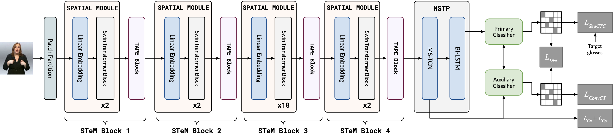

# LVM-STeM: Large Vision Models with Spatio-Temporal Modules for Continuous Sign Language Recognition

<!-- pdf based image -->

This repo is based on [VAC (ICCV 2021)](https://github.com/ycmin95/VAC_CSLR), [CorrNet (CVPR 2023)](https://github.com/hulianyuyy/CorrNet), and [PySlowFast](https://github.com/facebookresearch/SlowFast).

## Abstract



Sign language recognition remains a challenging task due to the intricate spatio-temporal dynamics of manual and non-manual gestures. In this work, we prostem LVM-STeM, a lightweight and hierarchical spatio-temporal encoder that effectively models these complex patterns using a combination of Swin Transformer backbones enhanced with novel temporal adapters, including our custom Temporal Adapter with Positional Embeddings (TAPE). Our architecture captures fine-grained spatial features alongside short- and long-term temporal context, enabling robust sign language recognition from RGB videos without relying on multi-stream inputs or auxiliary modalities. Extensive experiments on benchmark datasets including PHOENIX14, PHOENIX14T, and CSL-Daily demonstrate that LVM-STeM achieves state-of-the-art performance against RGB-based as well as multi-modal approaches, while maintaining competitive performance against multi-stream approaches. These results highlight the strength and efficacy of our the LVM-STeM framework for continuous sign language recognition.

| Dataset       | Dev WER (%) | Test WER (%) |
|:--------------| :-----: | :------: |
| PHOENIX2014   | 17.9 | 17.6 |
| PHOENIX2014-T | 18.1 | 18.9 |
| CSL-Daily     | 28.2 | 26.9 |

## Data Preparation
Please follow the instruction in [CorrNet](https://github.com/hulianyuyy/CorrNet) github repo to download and preprocess the datasets (PHOENIX2014, PHOENIX2014-T, CSL-Daily).
The structure of dataset directory is as follows (There may be other additional directories.):
```
dataset
├── phoenix2014
│   └── phoenix-2014-multisigner
│       └── features
│           └── fullFrame-256x256px
├── phoenix2014-T
│   └── features
│       └── fullFrame-256x256px
└── CSL-Daily
    └── sentence
        └── frames_256x256
```

## Setup Instructions

Follow these steps to set up the environment and get started:

1. **Clone the repository**:
   ```bash
   git clone https://github.com/gufranSabri/LVM_STeM.git
   cd stem86K-CSLR-Isharah
   ```

2. **Set up the Python environment**:
   - Install `virtualenv`:
     ```bash
     pip install virtualenv
     ```

   - Create a virtual environment and activate it:
     ```bash
     python<version> -m venv stem
     source stem/bin/activate
     ```

   - Install the required dependencies:
     ```bash
     pip install torch==1.13 torchvision==0.14 tqdm numpy==1.23.5 pandas opencv-python
     git clone --recursive https://github.com/parlance/ctcdecode.git
     cd ctcdecode && pip install .
     ```

### Training

To run our flagship model, you can use the following command:
```
python main.py --device 0,1 --dataset phoenix2014 --work-dir /data/ahmed026/phoenix/swinS_TAPE_MSTCN --model-args c2d_type=swins_mstcn-3
```


### Infererence

To evaluate a pretrained model, run the command below:

```
python main.py --device 0 --dataset phoenix2014 --phase test --load-weights <path/to/best/model> --work-dir ./work_dir/phoenix2014_test/
```
